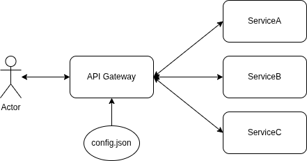

### API Gateway

```
User -> API Gateway -> Backend
```

```
helm upgrade -i prometheus oci://ghcr.io/prometheus-community/charts/kube-prometheus-stack -n monitoring --values values.yaml
```

```
minikube addons enable ingress
```

<div style="background-color: white; padding: 10px; border: 1px solid #ccc; width: 420px; margin-left: auto; margin-right: auto; display: block;">
  
</div>