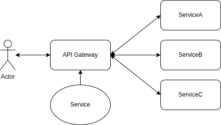

### API Gateway

```
User -> API Gateway -> Backend
```

```
helm upgrade -i prometheus oci://ghcr.io/prometheus-community/charts/kube-prometheus-stack -n monitoring --values values.yaml
```

```
minikube addons enable ingress
```

<p align="center">
  
</p>